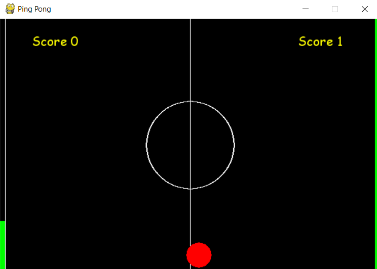

# SINGLE PINGPONG-hand 
Playing a pingpong game with just color detection  using opencv and python scripts
<p align="center">
  
</p>


Using opencv, to detect a specific colour(of the glove),and draw a contour over it and use the glove movements to move the centroid obtained from the operations.This will in turn move the paddle for the game.

The Game is written such a way that there is only a single player and you gotta survive for as much time as possible.

**Installation**

```
pip install virtualpp
```

Example

```
from virtualpp import final
final.GameColor("Green") 
```


(optional)You can integrate this into a projector inside a dark room and it will give good results.


